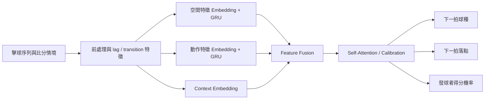

# AI CUP 2026 桌球戰術與回合結果多任務預測

以單一回合的擊球序列，同時預測下一拍球種（action）、落點（point）與發球者是否得分（win）。專案比較序列模型與梯度提升模型，重點包含雙流 GRU、Self-Attention、Focal Loss、類別不平衡處理、group-aware cross-validation 與機率校準。

## 成果

- 公開競賽紀錄：分數由約 **0.28** 提升至 **0.3511**
- Private Leaderboard：**第 50 名**
- 三個任務共用回合上下文，但使用獨立預測 head
- 競賽原始資料與 submission 未收錄於 repository

## 模型架構



## 實驗版本

| 檔案 | 主要方法 | 用途 |
|---|---|---|
| `train_lstm_groupcv.py` | LSTM、GroupKFold、加權 CE | 序列 baseline |
| `train_dual_stream_gru.py` | 空間／動作雙流 GRU、融合 head | 深度序列模型 |
| `train_shuttlenet_taa.py` | TAA、transition、focal loss、多 seed ensemble | 類別不平衡實驗 |
| `train_boosted_multitask.py` | LightGBM／XGBoost／CatBoost、Optuna、calibration | 最終表格特徵流程 |

目前保存的簡報只記錄整體分數進展，沒有足夠證據把單一增益歸因給某一模組，因此不杜撰逐項 ablation 分數。

## 執行

```bash
python -m venv .venv
pip install -r requirements.txt
python src/train_boosted_multitask.py --train data/train.csv --test data/test.csv --sample data/sample_submission.csv --outdir outputs/run1
```

序列模型範例：

```bash
python src/train_shuttlenet_taa.py --train data/train.csv --test data/test.csv --sample data/sample_submission.csv --out outputs/submission.csv
```

## Repository 結構

- `src/`：EDA、序列模型與 boosted-tree pipeline
- `results/figures/`：可公開的 EDA 圖
- `docs/project-summary.pptx`：專案總結簡報
- `environment.yml`、`requirements.txt`：環境定義

## 資料政策

AI CUP 原始訓練／測試資料可能受競賽條款限制，因此不隨 repository 散布。請依主辦單位規則自行取得資料，並放入本機 `data/`；該目錄已由 `.gitignore` 排除。
